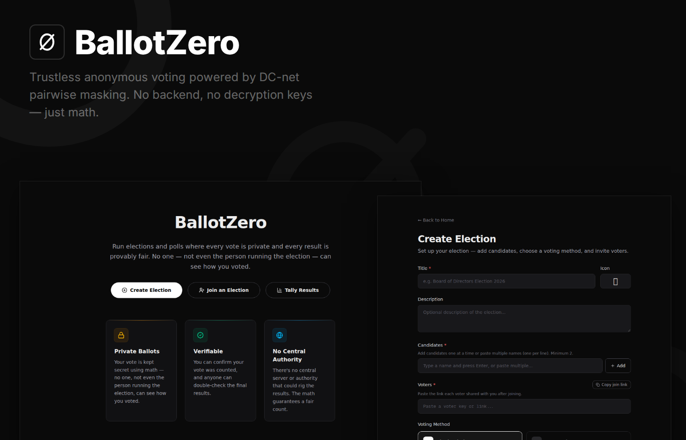

<div align="center">


# Ballot Zero

**Run elections and polls where every vote is private and every result is provably fair.**
**No one — not even the organizer — can see how you voted.**

A fully client-side voting system using a [Dining Cryptographers Network](https://en.wikipedia.org/wiki/Dining_cryptographers_problem) protocol to ensure individual ballot privacy while allowing the aggregate tally to be computed by simple addition. The election creator is purely a coordinator with no cryptographic privilege.

[](https://srujangurram.me/blog/anonymous-votes-with-math)



</div>


---

## ⚙️ How It Works

```
Voter → /join → connects wallet → gets reusable voter identity
                                          ↓
Creator → /create → adds voters + candidates → voting link
                                                    ↓
Voter → /vote → connects wallet → casts masked vote → ballot link
                                                           ↓
Creator → /tally → collects ballots → tally (masks cancel) → /results
```

1. **Join** — Each voter connects their wallet, signs a deterministic message, and receives a reusable voter identity. One-time step.
2. **Create** — The election creator sets up the election (title, candidates, voters, voting method) and gets a voting link.
3. **Vote** — Voters connect their wallet, select their choice, and the system masks their vote using pairwise ECDH secrets with every other voter. They share the resulting ballot link with the creator.
4. **Tally** — The creator collects all ballots. The system sums the masked vote vectors — all masks cancel out, revealing the plaintext tally. No decryption.
5. **Results** — Anyone can view and independently verify the tally.

## 🗳️ Voting Methods

- **Single Choice** — Pick one candidate (0/1 vector)
- **Approval** — Approve any number of candidates (0/1 vector)
- **Ranked Choice** — Rank candidates with configurable point weights (e.g. 5, 3, 1)

## 🔐 Cryptographic Protocol

BallotZero adapts DC-net for wallet-based voting:

**Key Derivation** — Each voter signs `BallotZero:onboard` with their wallet (MetaMask uses RFC 6979 deterministic ECDSA, so the same message always yields the same signature). The signature is hashed with SHA-256 to produce a secp256k1 private scalar. The same keypair is reused across elections; masks remain election-specific because `election_id` is mixed into the mask derivation.

**Pairwise Masking** — For any two voters, both independently compute the same ECDH shared secret. From this, deterministic mask values are derived per vote component. The voter with the smaller address adds the mask; the larger subtracts it. When all masked votes are summed, every mask term cancels:

```
Σ masked_votes = Σ (vote + mask) = Σ votes + 0
```

### Security Properties

| Property | Guarantee |
|----------|-----------|
| **Individual privacy** | A vote is hidden by N-1 pairwise masks. Recovering it requires ALL other voters' private keys. |
| **Information-theoretic security** | Privacy holds against computationally unbounded adversaries. |
| **Verifiability** | Anyone can re-sum published ballots and verify the tally. |
| **No trusted party** | No decryption key exists. The organizer cannot learn individual votes. |

### Trade-off

All voters must submit a ballot for masks to cancel. If any voter drops out, the tally is corrupted. This is acceptable for small elections where full participation is expected.

## 🚀 Getting Started

```bash
pnpm install
pnpm dev
```

Open [http://localhost:3000](http://localhost:3000).

### 🔑 Environment Variables

Create a `.env.local` file:

```
NEXT_PUBLIC_WALLETCONNECT_PROJECT_ID=your_project_id
```

Get a free project ID from [WalletConnect Cloud](https://cloud.walletconnect.com/).

## 🛠️ Tech Stack

- [Next.js 16](https://nextjs.org/) (App Router) with React 19
- [ConnectKit](https://docs.family.co/connectkit) + [wagmi](https://wagmi.sh/) + [viem](https://viem.sh/) — wallet connection & signing
- [@noble/curves](https://github.com/paulmillr/noble-curves) — secp256k1 point arithmetic & ECDH
- [@noble/hashes](https://github.com/paulmillr/noble-hashes) — SHA-256
- [Tailwind CSS](https://tailwindcss.com/) — styling (dark theme)
- [Biome](https://biomejs.dev/) — linting & formatting

## 📁 Project Structure

```
app/
├── join/page.tsx       # One-time voter identity setup
├── create/page.tsx     # Election creation
├── vote/page.tsx       # Voting interface
├── tally/page.tsx      # Ballot collection & vote counting
├── results/page.tsx    # Results display & verification
├── lib/
│   ├── crypto.ts       # DC-net protocol, ECDH, masking, serialization
│   └── storage.ts      # localStorage helpers
├── providers.tsx       # Wagmi + ConnectKit + React Query
├── layout.tsx          # Root layout
└── page.tsx            # Landing page
```

## 📄 License

MIT
